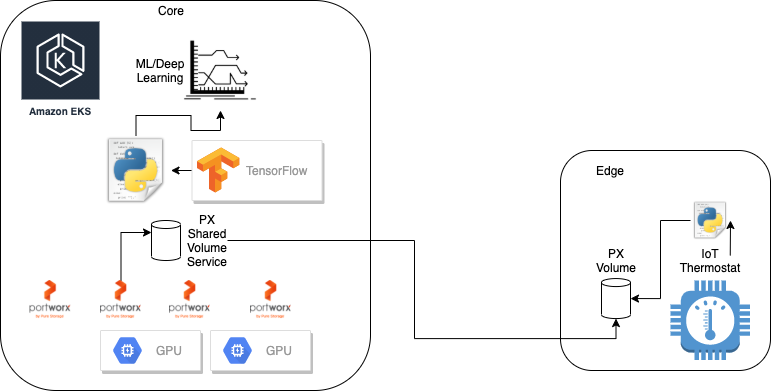

## Portworx at Edge: Deep Machine Learning with Keras (on Tensorflow 2.0)



### PX-Edge-App

This application uses Keras for deep machine learning of IoT data. Keras is a high-level API that is built on top of TensorFlow. It is extremely user-friendly and comparatively easier than TensorFlow. 

### What is a LSTM Model

This app uses a LSTM recurrent neural networks for time series prediction in Python with the Keras deep learning network.

The Long Short-Term Memory network, or LSTM network, is a recurrent neural network that is trained using Backpropagation Through Time and overcomes the vanishing gradient problem.

### Build

`docker build . -t repo/image:tag`

### Run

`docker run -p 127.0.0.1:5000:5000/tcp repo/image:tag`

### Kubernetes + Sensor Edge

#### Setup

##### EKS

Example EKS (eksctl) cluster tempalte in `eks`. Note this launches 4 PX nodes, 3 m5 nodes and 1 p3 GPU node.

Nodes should be labeled with `node-type/gpu=true` such as `kubectl label no ip-192-168-29-252.ec2.internal node-type/gpu=true`

Current there is also a bug where EKS does not run docker in correct cgroup owner for GPU (p3) node. Modify systemd ot cgroupfs.
```
vi /etc/kubernetes/kubelet/kubelet-config.json 
systemctl daemon-reload
systemctl restart kubelet.service
```

Then install PX
```
kubectl apply -f 'https://install.portworx.com/2.8.0?mc=false&kbver=1.20.4-eks-6b7464&b=true&s=%22type%3Dgp2%2Csize%3D150%22&kd=type%3Dgp2%2Csize%3D150&c=px-cluster-fefd3cfc-632c-4d5f-91bd-d8e20a439843&eks=true&stork=true&st=k8s'
```

##### K8s App

Create Shareedv4 Volume + Service with dummy pod.
```
kubectl create -f k8s/pvc-allow-all.yaml
kubectl create -f k8s/dummy.yaml
```

#### Sensor Edge

1. Create a sensor edge that collects Temperature + Humidity.
2. Write TEMPERATURE(FLOAT), HUMIDITY(FLOAT), DATE(DATETIME) to a csv called `edge_sensor_records.csv` to file
3. Sharedv4 used at the Edge where `edge_sensor_records.csv` resides

Example of mounting PX Sharedv4 Service at the edge on Raspberry Pi 2
```
apt-get install -y nfs-common 
mkdir /mnt/sensor_data/
mount -t nfs -o mountport=XXX,port=XXX,timeo=600,vers=3.0,actimeo=60,proto=tcp,retrans=8,soft XXXX:/var/lib/osd/pxns/XXX /mnt/sensor_data/
```

#### Kubernetes Core

Start Kubernetes Edge-App which reads, processes, graphs and models thermostat data
```
kubectl create -f k8s/edge-app.yaml
```

### Credits

- https://data-flair.training/blogs/stock-price-prediction-machine-learning-project-in-python/ 
- https://machinelearningmastery.com/standardscaler-and-minmaxscaler-transforms-in-python/ 
- https://towardsdatascience.com/step-by-step-guide-building-a-prediction-model-in-python-ac441e8b9e8b
- https://machinelearningmastery.com/save-load-keras-deep-learning-models/
- https://machinelearningmastery.com/time-series-prediction-lstm-recurrent-neural-networks-python-keras/
- https://stackoverflow.com/questions/65237843/predicting-stock-price-x-days-into-the-future-using-python-machine-learning
- https://towardsdatascience.com/time-series-forecasting-with-recurrent-neural-networks-74674e289816
- https://keras.io/
- https://kubernetes.io/docs/tasks/manage-gpus/scheduling-gpus/
- https://eksctl.io/usage/gpu-support/